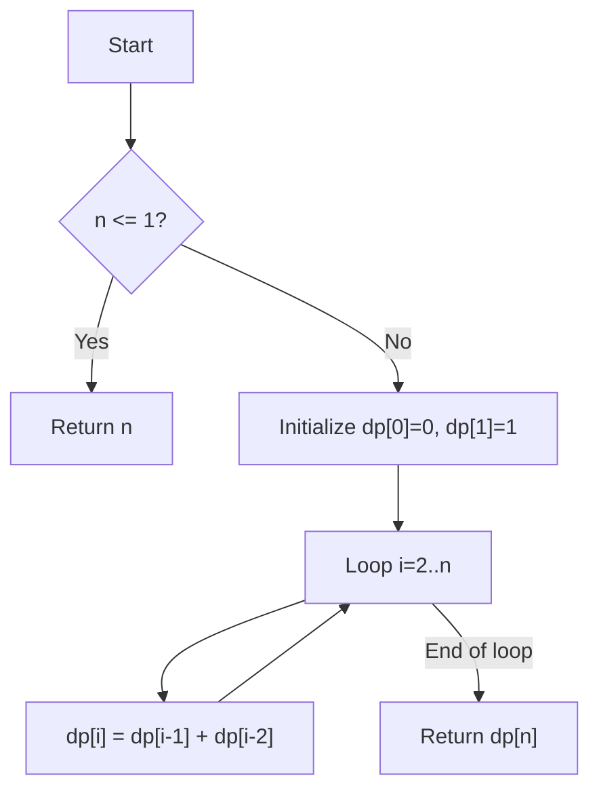
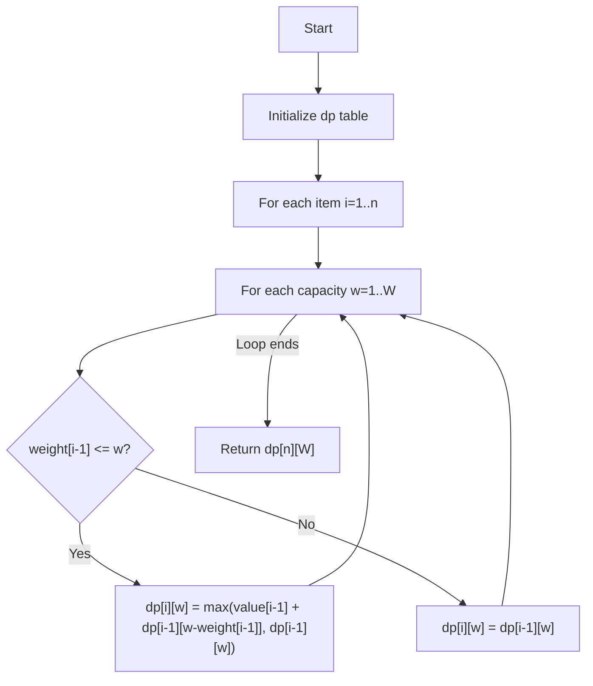

# Dynamic Programming Algorithms

This directory contains implementations of classic dynamic programming problems.

## Fibonacci (DP)

### Properties

- Time Complexity: O(n)
- Space Complexity: O(n) (can be optimized to O(1))

### Use-Cases

- Computing Fibonacci numbers efficiently.
- Teaching the concept of dynamic programming (overlapping subproblems).
- Useful in algorithm analysis and recurrence relation examples.

### How it works

Instead of solving the Fibonacci recurrence `F(n) = F(n-1) + F(n-2)` recursively (which leads to exponential calls),
we store already computed values in a table and build results from the bottom up.

### Flow

## 0/1 Knapsack

### Properties

- Time Complexity: O(n * W)
- Space Complexity: O(n * W)

Where `n` = number of items, `W` = capacity of the knapsack.

### Use-Cases

- Resource allocation problems.
- Choosing items to maximize profit under weight/space constraints.
- Foundation for optimization problems in logistics, scheduling, and finance.

### How it works

For each item, we decide whether to include it in the knapsack or not.
Dynamic programming is used to store optimal solutions for subproblems:

- `dp[i][w]` = maximum value achievable with first i items and capacity w.

### Flow

