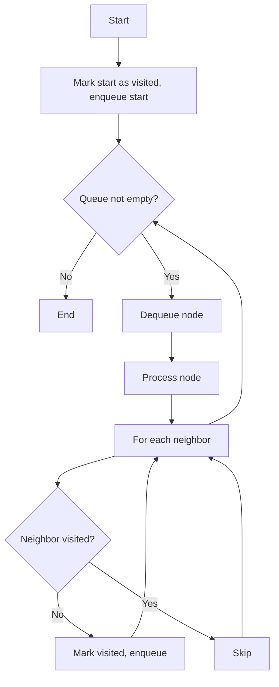
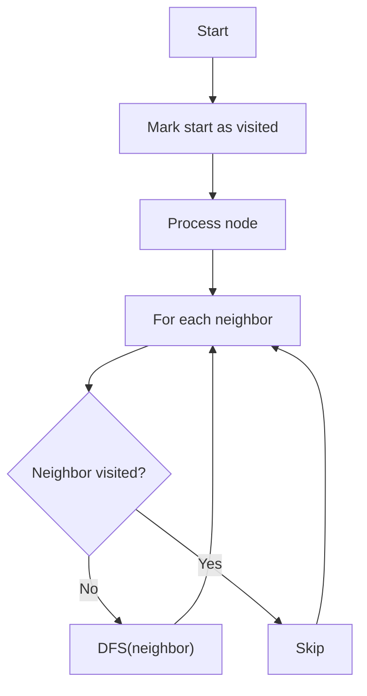
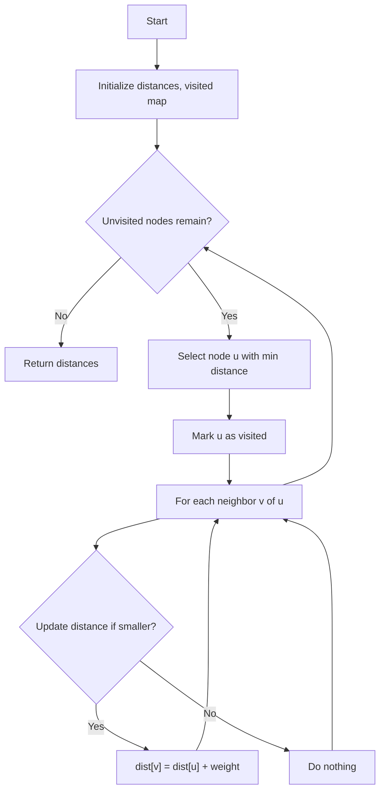

# Graph Algorithms

This directory contains implementations of fundamental graph algorithms.

## BFS (Breadth-First Search)

## Properties

- Time Complexity: O(V + E)
- Space Complexity: O(V)

### Use-Cases

- Shortest path in unweighted graphs.
- Level-order traversal in trees.
- Connectivity check.

### How it works

BFS explores nodes level by level using a queue. Each node is visited once and added to the queue if unvisited.

### Flow

## DFS (Depth-First Search)

## Properties

- Time Complexity: O(V + E)
- Space Complexity: O(V)

### Use-Cases

- Topological sorting.
- Cycle detection.
- Connectivity/component analysis.

### How it works

DFS explores as far as possible along each branch before backtracking. Implemented recursively or with a visisted map.

### Flow

## Dijkstra's Algorithm

## Properties

- Time Complexity: O(V^2) simplest, O((V + E) log V) with min-heap
- Space Complexity: O(V)

### Use-Cases

- Shortest path in weighted graphs.
- Routing, navigation.
- Network optimization.

### How it works

Dijkstra maintains distances from the start node. In each step, it selects the unvisited node with the smallest known distance, then relaxes its neighbors.

### Flow

