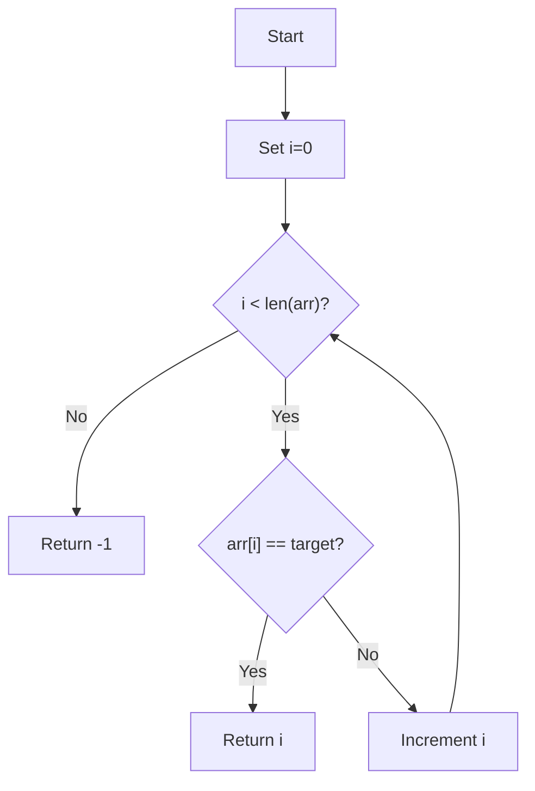
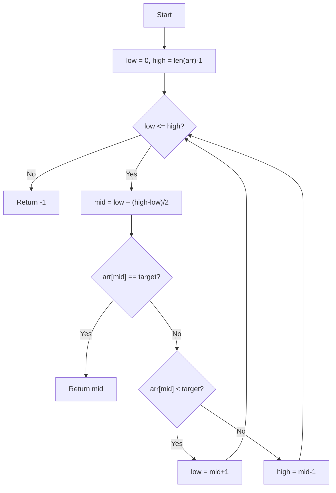

# Searching Algorithms

This directory contains implementations of fundamental searching algorithms.

## Performance Comparison

| Algorithm        | Time Complexity | Space Complexity |
|------------------|-----------------|------------------|
| Linear Search    | O(n)            | O(1)             |
| Binary Search    | O(log n)       | O(1)             |

## Linear Search

## Properties

- Time Complexity: O(n)
- Space Complexity: O(1)

### Use-Cases

- Unsorted datasets
- Small datasets where simplicity is more important than efficiency
- Teaching/learning algorithm basics

### How it works

Linear Search iterates through each element in the dataset sequentially until it finds the target value or reaches the end of the dataset.

### Flow

## Binary Search

## Properties

- Time Complexity: O(log n)
- Space Complexity: O(1)

### Use-Cases

- Sorted datasets
- Large datasets where O(n) search is too slow
- Frequently accessed data where fast lookups are critical

### How it works

Binary Search divides the sorted array in half repeatedly, comparing the middle element with the target until found or range exhausted.

### Flow

