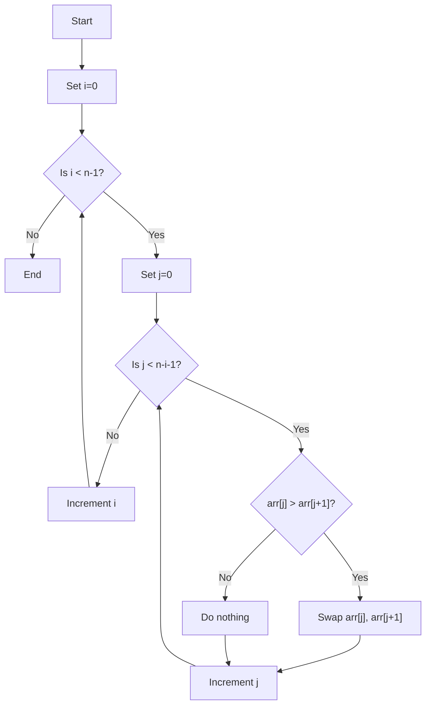
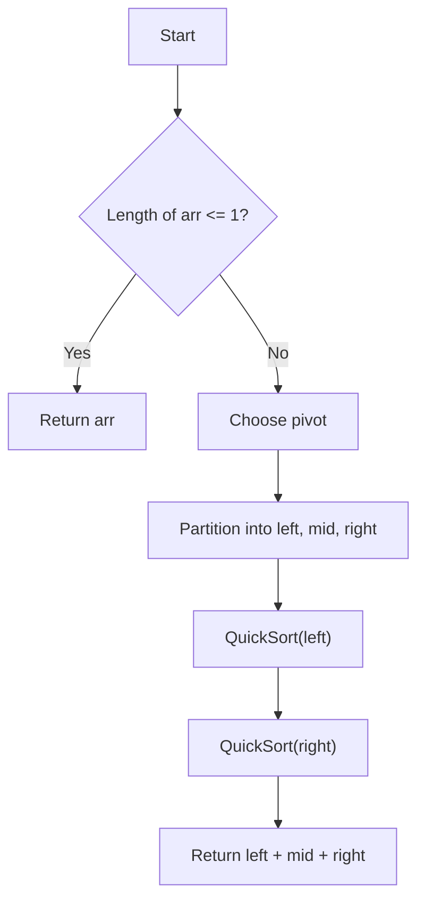
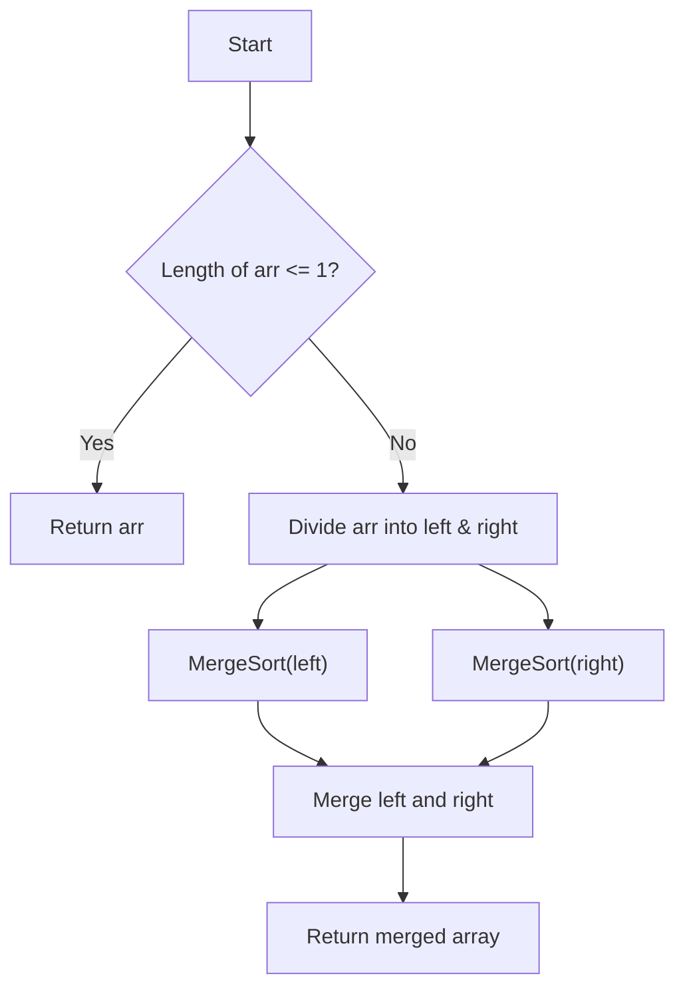

# Sorting Algorithms

This directory contains implementations of fundamental sorting algorithms.

## Performance Comparison

| Algorithm     | Time Complexity (Best) | Time Complexity (Average) | Time Complexity (Worst) | Space Complexity |
|---------------|------------------------|---------------------------|-------------------------|------------------|
| Bubble Sort   | O(n)                   | O(n²)                     | O(n²)                   | O(1)             |
| Quick Sort    | O(n log n)             | O(n log n)                | O(n²)                   | O(log n)         |
| Merge Sort    | O(n log n)             | O(n log n)                | O(n log n)              | O(n)             |

## Bubble Sort

### Properties

- Time Complexity: `O(n²)`
- Space Complexity: `O(1)`

### Use-Cases

- Teaching and learning sorting basics.
- Small datasets.
- Situations where simplicity matters more than performance.

### How it works

Bubble Sort repeatedly steps through the list, compares adjacent pairs, and swaps them if they are in the wrong order.
This process is repeated until no swaps are needed.

### Flow

## Quick Sort

### Properties

- Time Complexity: O(n log n) average, O(n²) worst
- Space Complexity: O(log n)

### Use-Cases

- Large datasets.
- General-purpose efficient sorting.
- Often used in libraries and production systems.

### How it works

Quick Sort selects a pivot element, partitions the array into elements less than, equal to, and greater than the pivot, and then recursively sorts the partitions.

### Flow

## Merge Sort

### Properties

- Time Complexity: O(n log n)
- Space Complexity: O(n)

### Use-Cases

- Sorting linked lists.
- Stable sorting requirements.
- Large datasets where consistent performance is needed.

### How it works

Merge Sort splits the array into halves, recursively sorts each half, and then merges them into a sorted array.

